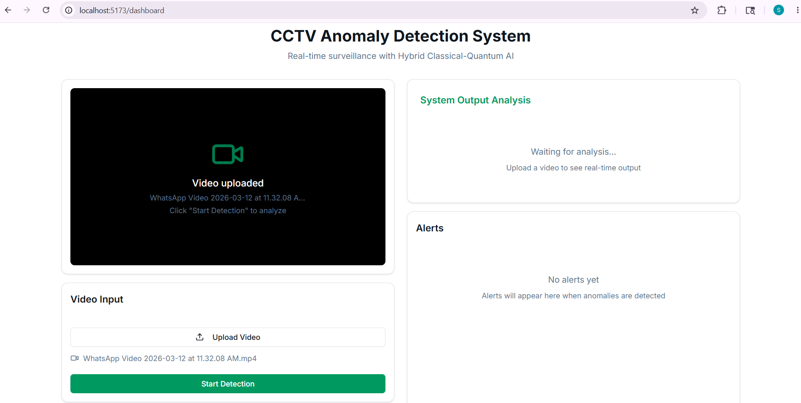
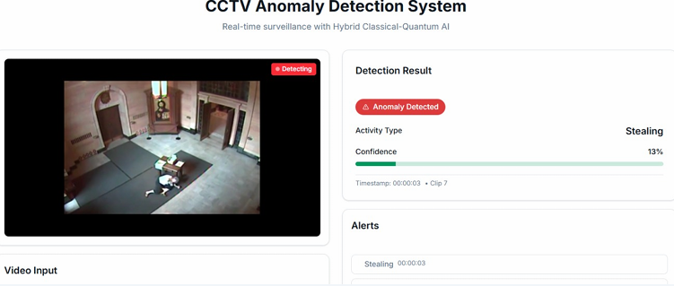
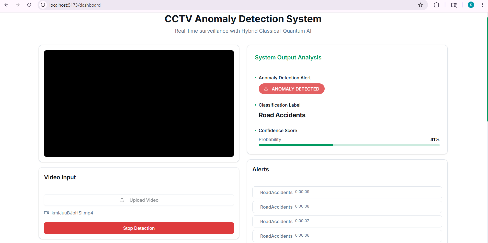

#  Real-Time CCTV Anomaly Detection System

An AI-powered surveillance system that detects unusual or suspicious activities in CCTV footage using a hybrid classical–quantum deep learning approach.

This project combines Convolutional Neural Networks (CNNs) for feature extraction with a Variational Quantum Circuit (VQC) implemented using PennyLane to improve anomaly detection performance.

---

## Problem Statement

Manual CCTV monitoring is:
- Time-consuming  
- Prone to human error  
- Inefficient for large-scale surveillance  

This system automates anomaly detection in real-time using AI and quantum-enhanced machine learning.

---

## Features

-  Real-time anomaly detection from video streams  
-  CNN-based spatial feature extraction  
-  Quantum-enhanced classification using VQC (PennyLane)  
-  Confidence-based anomaly scoring  
-  Interactive React-based dashboard  
-  Supports CCTV feed and video file input  
-  Fast inference using pre-trained model  

---

## System Architecture

Video Input → Frame Extraction → CNN Feature Extraction → Quantum Layer (VQC) → Anomaly Prediction → Frontend Visualization

---

## Tech Stack

- Backend: Python, Flask  
- Frontend: React (Vite)  
- Deep Learning: TensorFlow / Keras  
- Quantum Computing: PennyLane  
- Computer Vision: OpenCV  
- Dataset: UCF-Crime Dataset  

---


## Project Structure

```
cctv/
│── backend/
│   ├── app.py
│   ├── model.h5
│   ├── requirements.txt
│   └── utils/
│
│── frontend/
│   ├── src/
│   ├── public/
│   └── package.json
│
│── README.md
│── .gitignore
```

---

## Setup Instructions

## Backend

```bash
cd backend
python -m venv venv

# Activate virtual environment
# Windows:
venv\Scripts\activate

# Mac/Linux:
source venv/bin/activate

# Install dependencies:
pip install -r requirements.txt
python app.py
```


## Frontend

```bash
cd frontend
npm install
npm run dev
```

## Running the System

1. Start backend server
2. Start frontend server
3. Open browser at frontend URL
4. Upload CCTV/video feed for anomaly detection

## How It Works

1. Input video is processed frame by frame  
2. CNN extracts spatial features  
3. Features are passed to a quantum layer (VQC)  
4. Model predicts anomaly score  
5. Results are displayed on the frontend 

## Project Screenshots

### Dashboard


### Home Page


### Normal Video Detection


### Anomaly Detection 1


### Anomaly Detection 2


## Notes
1. model.h5 is excluded due to size constraints
2. Ensure backend is running before starting frontend
3. Best results achieved with UCF-Crime dataset